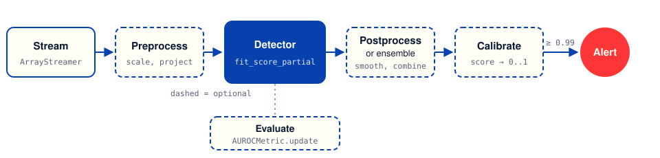
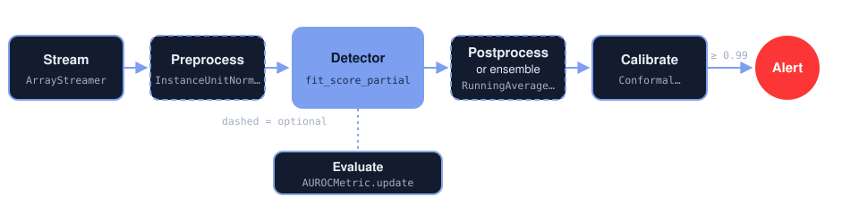
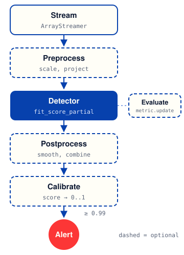
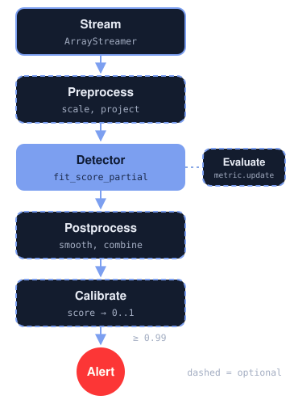

Concepts
========

This page explains streaming detection, pipeline components and evaluation. For instructions, see :doc:`getting_started` and the :doc:`how-to guides <guides/index>`.

Streaming anomaly detection
---------------------------

A stream is a sequence of records processed in arrival order, potentially indefinitely. An anomaly departs from the expected pattern: a sensor spike, fraudulent payment or failing server.

A batch detector, such as those in `PyOD <https://github.com/yzhao062/pyod>`_, trains on a fixed dataset and can then score new points. Updating that model generally requires retraining. An ongoing stream introduces three concerns:

- Points arrive one at a time, so scoring and learning must keep up with the arrival rate.
- Keeping every point would make memory grow without bound.
- Normal behavior can change over time (drift), making earlier data less representative.

A streaming detector updates its model of normal behavior with each point and assigns an anomaly score. Higher scores mean more anomalous points. It stores a summary, often a fixed-size window of recent points or scores.

The pipeline
------------

A PySAD pipeline is a loop over the stream. Each point goes through the same stages:

 raises an alert. A metric measures the scores while the stream runs.
   :class: only-light pipeline-wide

 raises an alert. A metric measures the scores while the stream runs.
   :class: only-dark pipeline-wide

 raises an alert. A metric measures the scores while the stream runs.
   :class: only-light pipeline-narrow

 raises an alert. A metric measures the scores while the stream runs.
   :class: only-dark pipeline-narrow

Only the stream and detector are required. Each stage manages its own state and can be added, removed or replaced independently.

.. list-table::
   :header-rows: 1
   :widths: 16 42 42

   * - Stage
     - Module
     - What it does
   * - Stream
     - :mod:`pysad.utils`
     - Gives the points one at a time. Your own loop over a file, a socket or a queue also works.
   * - Preprocess
     - :mod:`pysad.transform.preprocessing`, :mod:`pysad.transform.projection`
     - Scales a point, removes seasonality or reduces the number of features.
   * - Detect
     - :mod:`pysad.models`
     - Learns from the point and gives it an anomaly score.
   * - Postprocess
     - :mod:`pysad.transform.postprocessing`
     - Smooths or normalizes the scores over a window.
   * - Ensemble
     - :mod:`pysad.transform.ensemble`
     - Combines the scores of several detectors into one score.
   * - Calibrate
     - :mod:`pysad.transform.probability_calibration`
     - Maps a score to a value between 0 and 1 using a reference distribution of scores.
   * - Evaluate
     - :mod:`pysad.evaluation`
     - Measures the scores against labels (anomaly or normal), one point at a time.

.. _model-interface:

The model interface
-------------------

Every detector extends :class:`~pysad.core.BaseModel` and has two single-point methods. The API reference calls a point an instance:

``fit_partial(x)``
   Updates the model with ``x``, a NumPy array of shape ``(num_features,)``. Retained points are copied, so callers can reuse the input array.

``score_partial(x)``
   Returns a Python ``float`` score without changing the model or modifying or retaining ``x``.

Most loops use ``fit_score_partial(x)``: score ``x`` using earlier points, then learn from it. This is prequential evaluation, or test-then-train. Before learning, detectors return a fixed score, usually 0. :class:`~pysad.models.SeasonalESD` and :class:`~pysad.models.SeasonalHybridESD` instead test the window containing the newest value, as their paper specifies.

:class:`~pysad.core.BaseModel` provides ``fit(X)``, ``score(X)`` and ``fit_score(X)`` for arrays of shape ``(num_instances, num_features)``. Rows are processed in order. Batch scores are NumPy ``float64`` arrays of shape ``(num_instances,)``.

Preprocessors, projectors, postprocessors, ensemblers and calibrators follow the same pattern with ``fit_partial``, ``transform_partial`` and ``fit_transform_partial``. Running statistics, for example a running mean, use ``update`` and ``get``. Most of them also have ``remove``.

Calling only ``score_partial`` after training freezes the model while continuing to score new points.

Higher means more anomalous
---------------------------

Higher values mean more anomalous points across detectors, postprocessors, ensemblers and calibrators. The alert rule stays the same when components change: raise an alert at or above the threshold.

Raw score scales differ: detectors may return negative log densities, counts or 0 or 1. Calibrate scores before comparing different detectors.

Calibration
-----------

A calibrator converts a raw score into a value between 0 and 1. PySAD has four calibrators:

:class:`~pysad.transform.probability_calibration.AnomalyLikelihoodProbabilityCalibrator`
   Gives the anomaly likelihood of HTM (Hierarchical Temporal Memory), the detector of Numenta. It fits a Gaussian to the averages of each 10 consecutive recent scores. It returns one minus the probability that such an average is further from the mean than the average of the last 10 scores, on the same side of the mean. The value is 0.5 at the mean and close to 1 far from it. It expects scores between 0 and 1.

:class:`~pysad.transform.probability_calibration.ConformalProbabilityCalibrator`
   Gives the fraction of recent scores that are lower than the new score. A value of 0.99 means that the new score is higher than 99% of the scores in the window. In statistics, this value is one minus the conformal p-value. It makes no assumption about the distribution of the scores.

:class:`~pysad.transform.probability_calibration.GaussianTailProbabilityCalibrator`
   Fits a Gaussian distribution to recent scores using their mean and variance. Returns the probability of a lower score under this fit, assuming approximately Gaussian scores.

:class:`~pysad.transform.probability_calibration.SPOTProbabilityCalibrator`
   Fits a Generalized Pareto distribution to the highest scores with extreme value theory. It gives one minus the probability that a score is higher than the new score. It makes no assumption about the distribution of the scores, and it estimates the probability of scores that are higher than all scores seen so far.

A conformal threshold of 0.99 refers to rank within the recent window, not anomaly probability. About 1% of normal scores may exceed it under a stable distribution with few ties. Drift, dependence, ties and anomalies in the window affect the observed rate. Raising the threshold reduces alerts, including false alerts on normal points.

Prequential evaluation
----------------------

Prequential evaluation measures performance on unseen points: score each point, record the score in a metric, then learn from the point.

.. code-block:: python

   for x, label in streamer.iter(X, y):
       score = model.score_partial(x)
       metric.update(label, score)
       model.fit_partial(x)

Most examples use ``fit_score_partial`` to combine scoring and learning; see :ref:`the model interface <model-interface>`. :func:`~pysad.evaluation.evaluate_stream` runs this loop on labeled data and returns each metric’s final value.

The initial learning period is called warm-up. Full-stream metrics include it. To reveal changes over time, evaluate consecutive windows separately; see :doc:`guides/evaluate`.

Memory and time
---------------

Most PySAD detectors keep a summary of the stream, not the stream itself. The summary is one of these:

- A window of recent points, for example in :class:`~pysad.models.ExactStorm`, whose window slides by one point, and :class:`~pysad.models.xStream`, which replaces its window every ``window_size`` points.
- Histograms or sketches (compact counts of where points fall), for example in :class:`~pysad.models.LODA` and :class:`~pysad.models.RSHash`.
- A set of trees, for example in :class:`~pysad.models.HalfSpaceTrees` and :class:`~pysad.models.RobustRandomCutForest`.
- Running statistics, for example in :class:`~pysad.models.StandardAbsoluteDeviation`.

These summaries bound memory and processing time independently of stream length. Some detectors retain growing state; :doc:`detectors` lists each detector’s memory requirements.

Drift and forgetting
--------------------

Normal behavior changes over time. This change is drift. A detector follows drift only if it forgets old data. PySAD detectors handle old data in three ways:

.. list-table::
   :header-rows: 1
   :widths: 25 45 30

   * - How it forgets
     - Detectors
     - Effect
   * - A window of recent data
     - :class:`~pysad.models.xStream`, :class:`~pysad.models.HalfSpaceTrees`, :class:`~pysad.models.ExactStorm`, :class:`~pysad.models.ApproxStorm`, :class:`~pysad.models.MCOD`, :class:`~pysad.models.NETS`, :class:`~pysad.models.CPOD`, :class:`~pysad.models.D3`, :class:`~pysad.models.ThreshLEAP`, :class:`~pysad.models.IncrementalLOF`, :class:`~pysad.models.KELOS`, :class:`~pysad.models.IForestASD`, :class:`~pysad.models.SeasonalESD`, :class:`~pysad.models.SeasonalHybridESD`, :class:`~pysad.models.KNNCAD`, :class:`~pysad.models.MatrixProfile`, :class:`~pysad.models.DAMP`, :class:`~pysad.models.MedianAbsoluteDeviation`, :class:`~pysad.models.SpectralResidual`
     - Data older than the window has no effect. A smaller window follows drift faster.
   * - Time decay
     - :class:`~pysad.models.RSHash`, :class:`~pysad.models.RobustRandomCutForest`, :class:`~pysad.models.Inqmad`, :class:`~pysad.models.OnlineOneClassSVM`, :class:`~pysad.models.ChangeFinder`, :class:`~pysad.models.AnyOut`, :class:`~pysad.models.HoltWinters`
     - Old points count less and less. A larger ``decay`` (``time_decay`` for :class:`~pysad.models.RobustRandomCutForest`, ``alpha`` for :class:`~pysad.models.Inqmad`, ``learning_rate`` for :class:`~pysad.models.OnlineOneClassSVM`, ``discount`` for :class:`~pysad.models.ChangeFinder`, ``alpha``, ``beta`` and ``gamma`` for :class:`~pysad.models.HoltWinters`) follows drift faster. :class:`~pysad.models.Inqmad` learns only from points that it classifies as normal. With the default ``time_decay=0``, :class:`~pysad.models.RobustRandomCutForest` keeps a uniform sample of the whole stream and does not forget.
   * - No forgetting
     - :class:`~pysad.models.LODA`, :class:`~pysad.models.ADeMS`, :class:`~pysad.models.StandardAbsoluteDeviation`, :class:`~pysad.models.RelativeEntropy`, :class:`~pysad.models.TEDA`
     - Every point since the start counts equally, so the detector reacts more slowly to drift as the stream grows.

:class:`~pysad.models.DILOF` keeps the newest half of its window. Each time the window is full, it replaces the oldest half with a summary half its size, so old points count less and less.

:class:`~pysad.models.KitNet` learns only during its grace periods, the first points of the stream. :class:`~pysad.models.LocalOutlierProbability` learns only from its initial points. After that, these two detectors do not follow drift.

A detector that does not forget can still follow a large, permanent change if you start a new detector after the change. :doc:`guides/production` shows how.

Reproducible results
--------------------

Randomized detectors, such as those using random projections or tree splits, accept ``random_state``. An ``int`` reproduces results; ``None`` (the default) uses NumPy’s global random state.

To make a complete script reproducible, pass ``random_state`` to each component, or call :func:`pysad.utils.fix_seed` once at the start. ``fix_seed`` seeds the global state that ``random_state=None`` uses.

Labels
------

Labels identify anomalous and normal points. Most detectors are unsupervised and ignore ``fit_partial``’s ``y`` parameter, which provides a common interface. Evaluation metrics use labels; unsupervised detectors do not.
